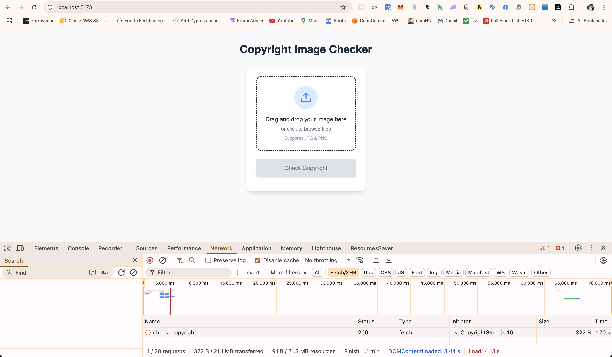
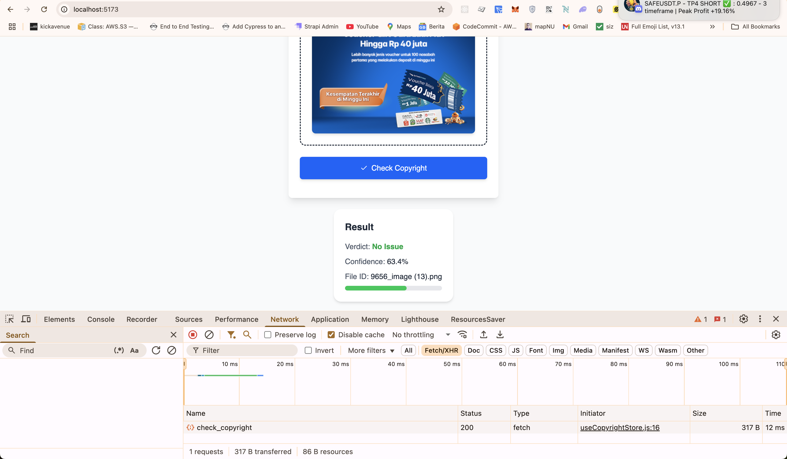
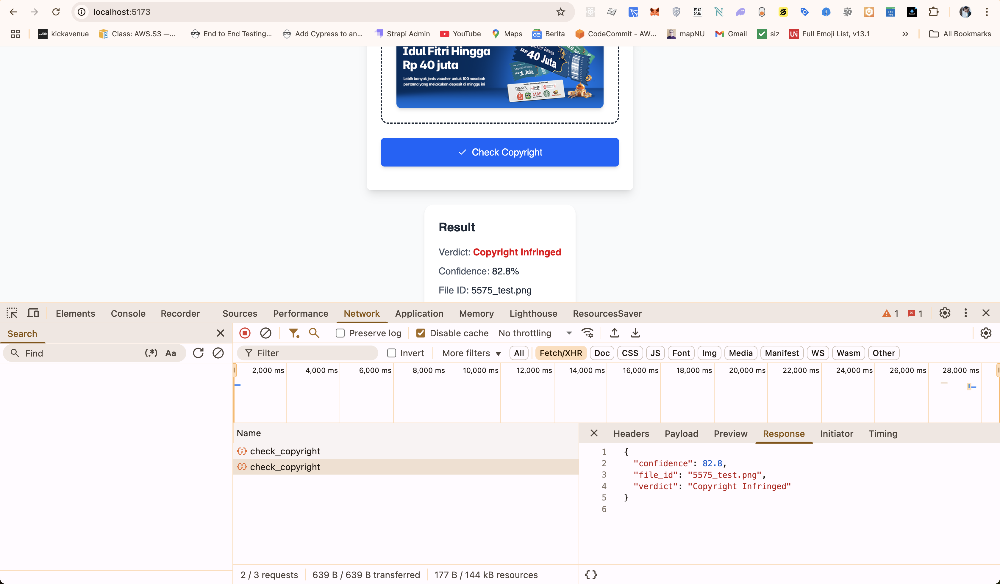

# 🛡️ Copyright Check App

A full-stack application to check if an image is potentially copyrighted using AI. The project is divided into two main parts:

- **Frontend** – Vue.js application for uploading and previewing images
- **Backend** – API service for processing images and returning copyright status

---

## 📁 Project Structure

```bash
copyright-check-app/
├── frontend/   # Vue 3 + Tailwind app for uploading and previewing images
│   └── README.md
├── backend/    # Python Flask API app with image classification logic
│   └── README.md
└── README.md  
```

Each subfolder contains its own README.md with setup and usage instructions.

## 📸 Screenshots

Below are screenshots of the project running locally:

  
  
  